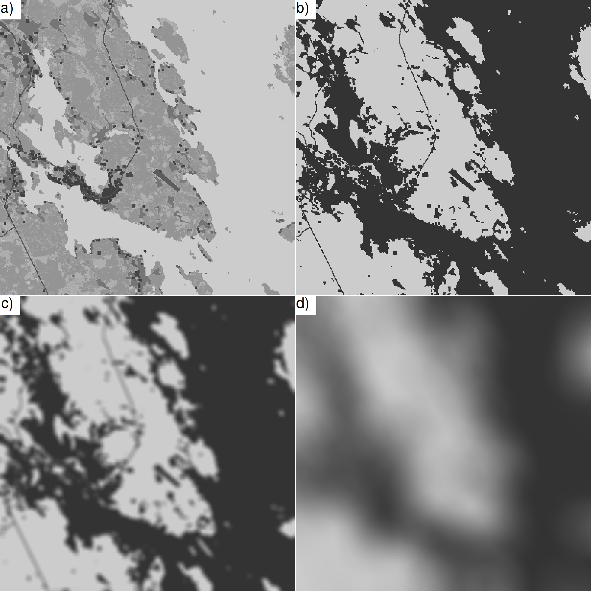

(View [PDF](https://github.com/statguy/Blur/README.pdf) of this document to view the equations.)

An R package for determining effective spatial scales of covariates using convolution.

Introduction
------------

Consider the linear predictor at location $\boldsymbol{s}_i$:
\[
\mu(\boldsymbol{s}_i) = \beta_{1} x_{1}(\boldsymbol{s}_i) + \ldots + \beta_{P} x_{P}(\boldsymbol{s}_i) +
  \gamma_{1} y_1 + \ldots + \gamma_{Q} y_Q +
  z_1(\boldsymbol{s}_i) + \ldots + z_R(\boldsymbol{s}_i) \quad (1)
\]
where $x_{1} \ldots x_{P}$ are spatial covariates with unknown effective spatial scale $\sigma$,
$\beta$s are unknown weights and $y_1 \ldots y_Q$ are other terms
such as non-spatial fixed effects with unknown weights $\gamma$ and
$z_1(\boldsymbol{s}_i) \ldots z_R(\boldsymbol{s}_i)$ are spatial and non-spatial random effects.

The spatial covariates are defined such that
\[
  x(\boldsymbol{s}_i) = \frac{\sum_{\boldsymbol{s}_j\in\Omega} K\left( \sigma^{-1} \| \boldsymbol{s}_i - \boldsymbol{s}_j \| \right) 1_{x=X(\boldsymbol{s}_j)} }
  {\sum_{\boldsymbol{s}_j\in\Omega} K\left( \sigma^{-1} \| \boldsymbol{s}_i - \boldsymbol{s}_j \| \right)} \quad (2),
\]
where the indicator function $1_{x=X(\boldsymbol{s}_j)}$ returns $1$ if the map $X(\boldsymbol{s}_j)$ contains the variable
$x$ at the location $\boldsymbol{s}_j$, or $0$ otherwise.
The equation (2) produces a subset of convolution and applying it over all locations in $\Omega$
generates visually a blur effect (hence the name of the package), where the blur is stronger for larger scales
(see figure 1).

Such construct captures spatial variation surrounding the covariate (eg. habitat type, population density,
elevation) at location $\boldsymbol{s}_i$ and typically the kernel function $K$ assings more weight on
the nearby locations than distant. There are two unknowns to be determined: 1) strength of the effect,
i.e. $\beta$ and 2) scale of the effect, i.e. $\sigma$.
The latter is the radius of the kernel and distances longer than that do not practically contribute to
the result. (The kernel function $K$ is unknown also, but we assume it to be known.)

In practice, models (1) cannot be estimated directly due to the heavy computation of the
$x(\boldsymbol{s}_i)$s and, instead, multiple $x(\boldsymbol{s}_i)$s at $\Sigma$ different fixed scales
$\sigma\in\{ \sigma_1 \ldots \sigma_\Sigma \}$ are precomputed. From those, the effective scale
and magnitude of the effect are found via variable selection.

This R package provides tools for finding convolution $x(\boldsymbol{s}_i)$ between map $X$ and kernel $K$
at each location $\boldsymbol{s}_i$ for each scale $\sigma_1 \ldots \sigma_\Sigma$. It is left to the user
to determine which scales are relevant depending on the nature of the generating spatial processes.
Once the covariates $x_1(\boldsymbol{s}_i) \ldots x_P(\boldsymbol{s}_i)$ are computed, they are included
in the model such as (1) and selected using WAIC or other variable selection method. The R package
[`SpaceTimeModels`](https://github.com/statguy/SpaceTimeModels/) provides spatial and spatio-temporal
model fitting, which may be helpful for the selection.



Installation
------------

The package is available in Github and can be installed with the following commmands:
```
library(devtools)
install.github("statguy/Blur")
```
The `devtools` package is needed to be installed first.
The package can be loaded with
```
library(Blur)
```

Kernels
-------

The following kernels are currently implemented in the package:

* `ExponentialKernel` for exponential smoothing and
* `GaussianKernel` for Gaussian smoothing.

Kernel objects are created with the `new` constructor, eg.
```
kernel <- ExponentialKernel$new()
```

User may specify custom kernels as well by inheriting from the `Kernel` class
and implementing the `constructKernelInternal` abstract method. See the
(source code)[https://github.com/statguy/Blur/blob/master/R/Kernel.R]
for examples.

Convolution
-----------

Convolution for the locations specified by x and y coordinates is performed with the functions

* `smoothContinuousSubsets` for continuous data and
* `smoothDiscreteSubsets` for discrete data with multiple classes.

Say that we have locations of the measurements in the variable `coords` (as `data.frame`, `matrix` or
`SpatialPoints` (of the `sp` package) class) and the continuous covariate raster (map) in `r`
as the `RasterLayer` object of the `raster` package. Using
```
x <- Blur::smoothContinuousSubsets(r=r, coords=coords, kernel=kernel,
  scales=c(1000,2000,4000))
```
the convolution is found for the scales 1000, 2000 and 4000 in the coordinate units defined
by the raster map `r`.

Edge values that should be ignored are specified with the `edgeValues` argument as a `numeric` vector.
By default no values in `r` are ignored except `NA`.

For a multivalued discrete raster, the corresponding call is
```
x <- Blur::smoothDiscreteSubsets(r=r, coords=coords, kernel=kernel,
  scales=c(1000,2000,4000), smoothValues=c(1,2,3))
```
where `smoothValues` argument specifies a vector of the values to be smoothed.

The covariates are returned in wide format, but can be returned in the long format with the `wide=FALSE`
argument.

By default, the convolution is performed in parallel taking advantage of the multicore/multiprocessor environment
if available, but can be turned off by setting the `.parallel=FALSE` argument. The parallel computation is
enabled by installing the `doMC` package and issuing the following commands first:
```
library(parallel)
library(doMC)
registerDoMC(cores=detectCores())
```

Additional remarks
------------------

Convolution may produce undesired effects near the edges of the covariate raster if not properly handled.
The smoothing functions cuts the kernel $K$ if outside the raster $X$ and rescales
it so that the kernel matrix values sum to unity. This ensures that no artifacts are generated near the edges.

Note that the convolution is performed only at the measurement and prediction locations, which is usually
much smaller number than the data available in the covariate raster (denoted with $X$) files. There are faster
ways to perform the convolution over the whole study area, but working with large raster files may lead to
memory issues.

The functions `smoothContinuousSubsets` and `smoothDiscreteSubsets` are the same except the latter creates
a binary mask of a subset of the raster where the convolution is applied on. The same result is achieved by
masking the whole raster and supplying it to `smoothContinuousSubsets`. However, using subsets saves memory.

Feedback
--------
For feedback, please contact Jussi Jousimo at <jvj@iki.fi>.
